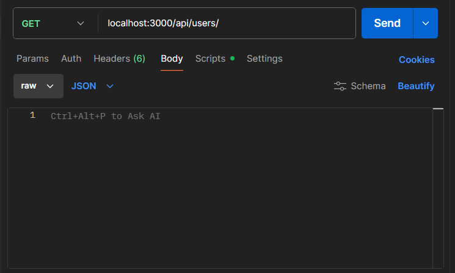

# Express Users API (Learning Project)

A simple CRUD API made as part of a walkthrough tutorial with Simplilearn.
A link to the course can be found [here](https://www.simplilearn.com/learn-nodejs-basics-free-course-skillup?tag=node.js).

The API works with an in-memory user list and demonstrates how to structure routes using `express.Router()`.

---

## Installation

Start by typing these into the terminal:

```bash
git clone https://github.com/AlistairDriscoll/node-express
cd node-express
```

Then install dependencies:

```bash
npm install
```

### Running The Server

To run the server simply type:

```bash
node index.js
```

then the server will run on http://localhost:3000


## API Overview

All user-related endpoints are handled in:

routes/api/users.js using express.Router()

#### Get

GET /api/users returns the full user list
GET /api/users/:id returns a single user if the ID exists.

#### Post

If you send:

{
  "name": "Example",
  "email": "example@gmail.com"
}

to api/users then it will create a new user with those details along with creating their id, then return the full updated list.


#### Updating Users

PUT /api/users/:id

plus send any field you would like to update:

{
  "name": "New Name"
}

will update the fields you have included.

#### Deleting Users

DELETE /api/users/:id

Will delete the user from the list.

## To Test

I used [postman](https://www.postman.com/), an API development tool to do the testing. You can put the URL along with the necessary information and send requests to the server using this technology. Really useful to see how things are working! Just go to body section and click the 'raw' option to input any information in a JSON format.



## Notes

This project stores data in memory, so changes reset when the server restarts.

The purpose of the project is to practise:

Express routing

Using express.Router()

Basic CRUD operations

Sending and receiving JSON

No database or authentication is included (tutorial-level project).